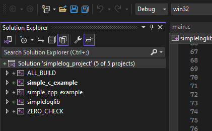
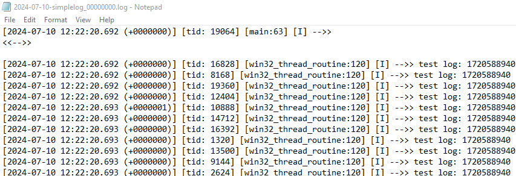
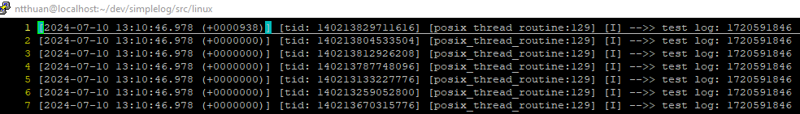

# simplelog

## 0. Preface

[**Thanks a lot to:**](https://www.bing.com/search?form=SKPBOT&q=Thanks%20a%20lot%20to%3A)

1. My family, friends.
2. [**W. Richard Steven**](https://www.bing.com/search?form=SKPBOT&q=W.%20Richard%20Steven) - Unix Network Programming - Volume I, II. The books bring C/C++ programming career to me.
3. My colleagues: Lê Duy Cường, Bùi Khánh Duy, Nguyễn Công Đức , ...

[**Purpose:**](https://www.bing.com/search?form=SKPBOT&q=Purpose%3A)

1. A C/C++ log is to support multithread.
2. A pattern of designation of multi-thread, signaling, realtime.
3. Without using third party except Posix APIs, Win32 APIs.
4. Portable: Windows, Unix-Like (Linux, Mac, Solaris, Android, iOS, ...)
5. Focus on simplicity.
6. An sample following [**W. Richard Steven**](https://www.bing.com/search?form=SKPBOT&q=W.%20Richard%20Steven) Unix Network Programming - Volume II, Part 3 - Synchronization, Chapter 7, 8, 9, 10, 11.
7. Fast and small.

## 1. Configuration and build (did test on x86_64 as below, still in progress)

| OS                | Tool/SDK                 | Steps                                                                                                                                                                                                 | Prerequisite                                                                 |
|-------------------|--------------------------|------------------------------------------------------------------------------------------------------------------------------------------------------------------------------------------------------|-------------------------------------------------------------------------------|
| Windows 10, 32 bits | Microsoft Visual Studio 2022 | 1. Come to [**src**](https://github.com/thuanalg/simplelog/tree/master/src) folder. 2. Comment the macro [**UNIX_LINUX**](https://en.wikipedia.org/wiki/Unix-like) in [**simplelog_config.h**]  3. Run: `cmake -G "Visual Studio 17 2022" -A win32 -B ../build32`. "../build32" is an output folder. 4. Move to the output folder "../build32" to build and run test. 5. Copy [**src/simpleplog.cfg**](https://github.com/thuanalg/simplelog/blob/master/src/simplelog.cfg) to ../build32 | 1. [**cmake**](https://www.bing.com/search?form=SKPBOT&q=cmake), however, you can add the files (from [**src**](https://www.bing.com/search?form=SKPBOT&q=src)) manually/directly. 2. Visual Studio 2022 (Community version or any.) |
| Windows 10, 64 bits | Microsoft Visual Studio 2022 | 1. Come to [**src**](https://www.bing.com/search?form=SKPBOT&q=src) folder. 2. Comment the macro [**UNIX_LINUX**](https://www.bing.com/search?form=SKPBOT&q=UNIX_LINUX) in [**simplelog_config.h**](https://github.com/thuanalg/simplelog/blob/master/image/Windows-00.PNG) 3. Run: `cmake -G "Visual Studio 17 2022" -B ../build64`. "../build64" is an output folder. 4. Move to the output folder "../build64" to build and run test. 5. Copy [**src/simpleplog.cfg**](https://github.com/thuanalg/simplelog/blob/master/src/simplelog.cfg) to ../build64 | 1. [**cmake**](https://www.bing.com/search?form=SKPBOT&q=cmake), however, you can add the files (from [**src**](https://www.bing.com/search?form=SKPBOT&q=src)) manually/directly. 2. Visual Studio 2022 (Community version or any.) |
| Linux, 64 bits     | gcc/g++                  | 1. Come to [**src**](https://www.bing.com/search?form=SKPBOT&q=src), change the file: https://github.com/thuanalg/simplelog/blob/master/image/linux-00.PNG.  2. Come to [**src/linux**](https://www.bing.com/search?form=SKPBOT&q=src%2Flinux) folder. 3. Run: `make`. 4. Copy [**src/simpleplog.cfg**](https://github.com/thuanalg/simplelog/blob/master/src/simplelog.cfg) to [**src/linux**](https://www.bing.com/search?form=SKPBOT&q=src%2Flinux).                                                      | 1. gcc/g++. 2. POSIX, POSIX thread.                                        |

## 2. Run

| OS      | Step                                                                                       | Note                                                                                          |
|---------|--------------------------------------------------------------------------------------------|-----------------------------------------------------------------------------------------------|
| Windows | Come to the output folder. Run `simple_c_example.exe 2000` Or run `simple_cpp_example.exe 2000`    | Output 2000 is number of threads. Let's assess performance of the library/sample for yourself. |
| Linux   | Come to the output folder. Run `./simpplelog_sample 2000` Run `./simpplelog_cpp_sample 2000`    | Output 2000 is number of threads. With `simpplelog_cpp_sample`, you have to export `LD_LIBRARY_PATH=$LD_LIBRARY_PATH:./` Because `simpplelog_cpp_sample` depends on `libsimplelog.so`. Let's assess performance of the library/sample for yourself. |

## 3. APIs manual

| Index | Name             | Description                                                                 | Thread-safe |
|-------|------------------|-----------------------------------------------------------------------------|-------------|
| 1     | `spl_init_log(char *pathcfg)`   		| The path to [**configuring file**](https://github.com/thuanalg/simplelog/blob/master/src/simplelog.cfg) .                                              | Yes         |
| 2     | `spllog(level, fmt, ...)`         	| Level is `SPL_LOG_DEBUG`, `SPL_LOG_INFO`, `SPL_LOG_WARNING`, `SPL_LOG_ERROR`, `SPL_LOG_FATAL` | Yes         |
| 3     | `spl_finish_log()` 					| Finish log.                                                                 | Yes         |